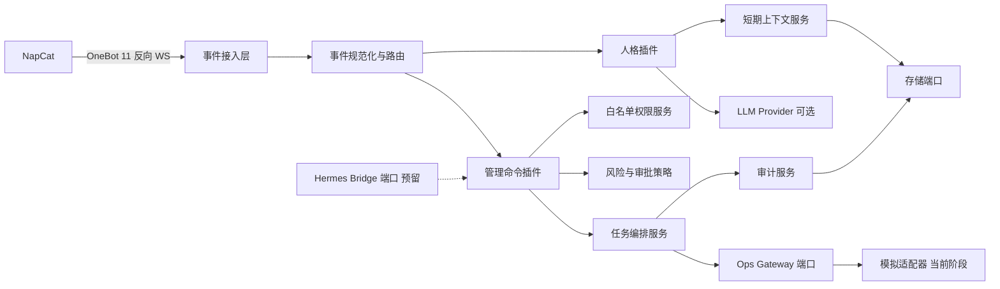
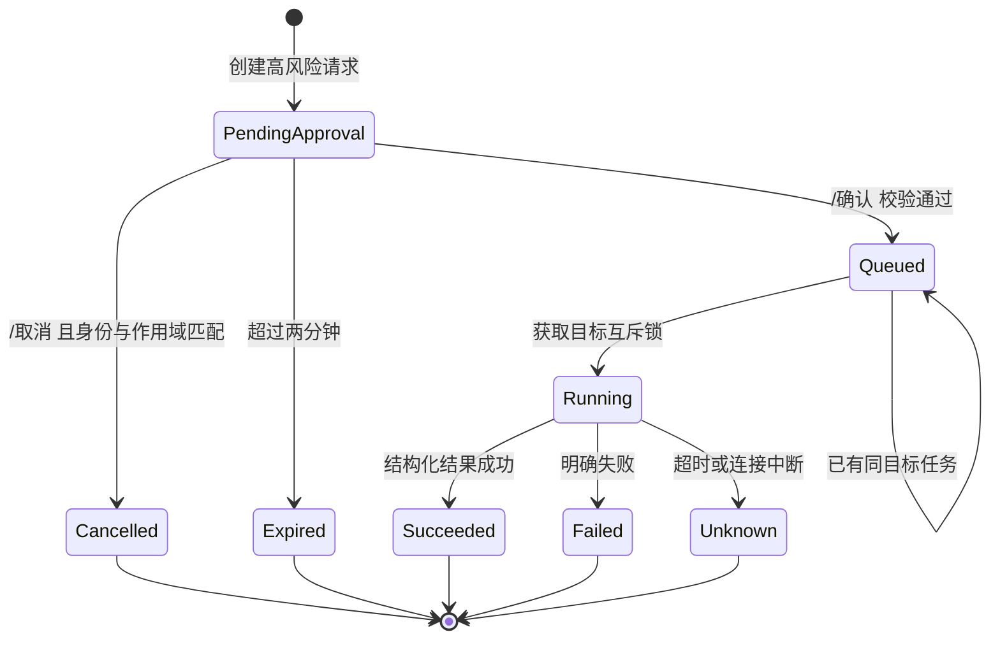

# QQ个人管家机器人系统设计说明书

- **文档版本**：v1.0
- **对应需求**：QQ个人管家机器人_需求规格说明书_v1.0.md
- **当前阶段**：MVP 机器人脚本设计
- **设计状态**：待评审
- **目标运行形态**：NoneBot2 + OneBot 11；Hermes 尚未部署

## 1. 文档目的

本文档将需求规格说明书转换为可直接进入编码阶段的系统设计，重点覆盖当前需要落地的机器人脚本。设计默认从零建立 NoneBot2 项目，并保留真实 Ops Gateway 与 Hermes Agent 的替换接口。

当前阶段明确不依赖 Hermes，不在机器人进程内启动 Shell 或交互式终端。服务器运维使用模拟 Ops Gateway 完成命令解析、权限、审批、任务状态机和审计流程验证；未来只替换能力适配器，不改变 QQ 侧交互协议。

## 2. 设计目标与范围

### 2.1 当前阶段目标

1. 建立 NapCat 通过 OneBot 11 反向 WebSocket 接入 NoneBot2 的机器人骨架。
2. 统一处理群聊和私聊消息，并以事件中的 `sender_id` 作为唯一身份依据。
3. 实现群聊短期上下文、硬触发、软触发、静音、冷却和主动回复限额。
4. 实现白名单用户的确定性 `/服`、`/任务`、`/确认`、`/取消` 命令。
5. 实现高风险运维操作的确认码、超时、幂等、互斥和审计记录。
6. 使用模拟 Ops Gateway 返回可控的服务器状态和任务结果。
7. 为 MySQL、真实 Ops Gateway、Hermes 和 Minecraft 桥接预留清晰接口。

### 2.2 当前阶段不实现

- 不接入 Hermes API，不安装或启动 Hermes Agent。
- 不允许任意 Shell、SQL、脚本、路径或命令参数从 QQ 直接进入执行层。
- 不实现真实服务器控制、Minecraft 双向桥接和长期记忆。
- 不将全部群消息永久写入数据库。
- 不实现 Web 管理后台、多租户、计费和多平台接入。

### 2.3 设计原则

- **身份与文本分离**：权限只取自 OneBot 事件的 `sender_id`，不信任昵称、转发内容或自然语言自称。
- **聊天与运维分离**：人格模块可以调用 LLM；运维模块只能产生结构化动作。
- **能力与框架分离**：插件通过应用服务和端口接口协作，不直接耦合 OneBot 细节或底层资源。
- **默认拒绝**：配置缺失、数据库不可用、目标不存在、确认码不匹配时均不执行动作。
- **先审计后执行**：高风险操作必须先创建待审批记录，再执行结构化动作。
- **可替换适配器**：模拟实现只用于验证流程，真实实现通过同一接口接入。

## 3. 总体架构



### 3.1 分层职责

| 层次 | 模块 | 主要职责 | 禁止事项 |
|---|---|---|---|
| 接入层 | OneBot 11 / NoneBot2 adapter | 接收事件、发送消息、连接重连 | 放置业务权限和运维逻辑 |
| 规范化层 | `event_ingest` | 事件去重、标准化、会话定位、路由 | 判断 LLM 回复内容是否可信 |
| 应用层 | `persona`、`admin_command` | 群聊人格、命令交互、回复编排 | 执行任意系统命令 |
| 核心服务层 | `auth`、`approval`、`job`、`audit`、`config` | 权限、审批、任务状态、审计和配置 | 依赖具体 OneBot CQ 码 |
| 能力适配层 | `OpsGateway`、`LlmProvider`、`HermesClient` | 对外部能力进行抽象和替换 | 绕过权限或直接暴露凭据 |
| 存储层 | 内存存储 / ORM 适配器 | 上下文、待审批、任务和审计持久化 | 保存密钥和未经授权的完整消息 |

## 4. 建议项目结构

```text
bot/
├─ pyproject.toml
├─ .env.example
├─ README.md
├─ nonebot_plugin_localstore/       # 可选：本地配置和数据目录
├─ src/
│  ├─ bot.py                         # NoneBot 启动入口
│  ├─ config.py                      # 配置加载、校验和默认值
│  ├─ core/
│  │  ├─ models.py                   # 领域模型和枚举
│  │  ├─ errors.py                   # 业务异常
│  │  ├─ ports.py                    # 存储、运维、LLM、Hermes 接口
│  │  ├─ services/
│  │  │  ├─ auth_service.py          # sender_id 白名单校验
│  │  │  ├─ approval_service.py      # 确认码生命周期
│  │  │  ├─ job_service.py           # 任务状态机、幂等和互斥
│  │  │  ├─ audit_service.py         # 审计事件
│  │  │  └─ rate_limit_service.py    # 发送和命令限流
│  │  └─ runtime.py                  # 单例依赖和生命周期管理
│  ├─ adapters/
│  │  ├─ memory_store.py             # MVP 内存实现
│  │  ├─ mock_ops_gateway.py         # 模拟服务器能力
│  │  ├─ null_llm.py                 # LLM 未配置时的安全实现
│  │  ├─ future_hermes.py            # Hermes 预留适配器
│  │  └─ onebot_sender.py            # 消息发送和敏感信息脱敏
│  └─ plugins/
│     ├─ event_ingest/
│     │  ├─ __init__.py
│     │  ├─ normalize.py              # OneBot 事件转内部事件
│     │  └─ dedup.py                  # message_id 幂等
│     ├─ persona/
│     │  ├─ __init__.py
│     │  ├─ context.py                # 群级滚动窗口
│     │  ├─ gate.py                   # 硬/软触发和总闸门
│     │  └─ responder.py              # LLM 调用、输出检查和回复
│     ├─ admin_command/
│     │  ├─ __init__.py
│     │  ├─ parser.py                 # 确定性命令解析
│     │  ├─ matcher.py                # 群聊/私聊命令 Matcher
│     │  └─ handler.py                # 权限、审批和任务交互
│     └─ agent_bridge/
│        ├─ __init__.py               # 当前禁用，仅保留注册点
│        └─ protocol.py               # Hermes 接口和会话模型
└─ tests/
   ├─ unit/
   ├─ integration/
   └─ fixtures/
```

目录名称可按 NoneBot2 插件加载约定调整，但业务模块应保持上述边界。`plugins` 只负责消息适配和交互；核心服务不得反向导入具体插件。

## 5. 领域模型

### 5.1 内部消息模型

```python
@dataclass(frozen=True)
class NormalizedMessage:
    message_id: str
    sender_id: str
    sender_alias: str
    scope_type: Literal["group", "private"]
    scope_id: str
    text: str
    message_type: str
    reply_to: str | None
    is_at_bot: bool
    created_at: datetime
```

`scope_id` 在群聊中为 `group_id`，私聊中为发送者 QQ 号。群聊上下文与私聊上下文必须使用不同的作用域键，禁止互相读取。

### 5.2 运维模型

```python
@dataclass(frozen=True)
class ServerTarget:
    server_id: str
    display_name: str
    capabilities: frozenset[str]

@dataclass(frozen=True)
class OperationRequest:
    operation_id: str
    actor_qq_id: str
    scope_type: Literal["group", "private"]
    scope_id: str
    action: Literal["status", "players", "logs", "start", "stop", "restart", "backup"]
    server_id: str
    normalized_params: dict[str, str]
    risk_level: Literal["R0", "R1", "R2", "R3"]

@dataclass
class OperationJob:
    operation_id: str
    request: OperationRequest
    state: Literal["pending_approval", "queued", "running", "succeeded", "failed", "unknown", "cancelled"]
    approval_code_hash: str | None
    approval_expires_at: datetime | None
    result_summary: str | None
```

QQ 消息层只能构造 `OperationRequest`，不能构造 Shell 字符串、SQL、文件路径或任意环境变量。

## 6. 消息接入与路由

### 6.1 接入流程

1. NoneBot2 收到 OneBot 11 群消息或私聊事件。
2. `event_ingest` 提取 `message_id`、`sender_id`、会话类型、会话 ID、文本和回复关系。
3. 以 `message_id` 查询去重存储；已处理事件直接结束。
4. 过滤机器人自身消息，避免自触发和桥接回环。
5. 对指定群执行群配置检查；未启用的群不进入人格处理。
6. 同一规范化事件可分别进入管理命令路由和人格路由，但命令路由优先处理。

### 6.2 路由优先级

| 优先级 | 路由 | 规则 |
|---|---|---|
| 1 | 系统命令 | 文本严格匹配 `/服`、`/任务`、`/确认`、`/取消`、`/帮助` |
| 2 | Hermes 预留 | 当前关闭；未来只接受白名单用户 |
| 3 | 硬触发人格 | @机器人、回复机器人、昵称前缀 |
| 4 | 软触发人格 | 通过本地门控和概率抽样 |
| 5 | 上下文消费 | 记录短期上下文，不发送回复 |

命令路由不把管理命令交给 LLM 解释。非白名单用户发送运维文本时，命令解析可以识别为命令，但必须在权限校验前结束，不创建任务和审计操作记录；可按配置交给普通聊天处理或保持沉默。

## 7. 群聊人格设计

### 7.1 上下文策略

- 每个群独立维护一个滚动窗口。
- 默认最多 30 条消息或 1200 秒，先达到者淘汰。
- 只保存发送者 ID 的不可逆展示标识、昵称快照、时间、规范化文本、类型和 `reply_to`。
- 不默认下载图片、文件和语音原件；消息中仅保留类型或占位信息。
- LLM 调用前按群配置截取上下文，禁止混入私聊和其他群内容。

### 7.2 触发门控

```text
收到消息
  ├─ 机器人自身消息？ -> 丢弃
  ├─ 管理命令？       -> 管理命令流程
  ├─ 群未启用/全局维护？ -> 仅消费或丢弃
  ├─ 夜间且非硬触发？ -> 仅消费
  ├─ 命中禁止触发？    -> 仅消费并记录原因
  ├─ 硬触发？          -> 检查限流后进入回复
  └─ 软触发？          -> 候选评分 -> 概率抽样 -> 检查额度 -> 回复或沉默
```

默认策略：主动概率 0.02、群级冷却 600 秒、用户级冷却 1200 秒、每小时最多 3 次主动回复、主动回复不连续出现、文本不超过 80 个汉字。硬触发不受主动概率限制，但仍受限流、审核和总闸门约束。

### 7.3 LLM 安全边界

- LLM 仅用于群聊人格回复，不参与身份判断、权限判断、命令解析或执行结果判定。
- 发送前执行长度限制、敏感信息检查、提示注入隔离和空回复检查。
- LLM 超时、异常、审核失败或输出违规时不发送半截内容。
- LLM 不可用时关闭主动回复；硬触发可返回固定降级文本。
- 不默认记录完整 Prompt 和完整模型响应，仅记录触发类型、耗时、结果和拒绝原因。

## 8. 权限与管理命令

### 8.1 权限校验

```python
def is_whitelisted(sender_id: str, whitelist: set[str]) -> bool:
    return sender_id in whitelist
```

所有管理命令在执行前必须调用权限服务。`sender_id` 必须从 OneBot 事件提取并以字符串规范化；昵称、群管理员标志、消息正文和 @ 内容都不能替代该字段。

权限检查失败时：

- 不创建 `operation_job`。
- 不调用 Ops Gateway。
- 不创建高风险确认码。
- 不写入包含目标服务器和参数的运维审计记录。
- 可记录通用的拒绝计数，但不能将敏感命令原文写入日志。

### 8.2 命令语法

```text
/服 状态 [服名]
/服 玩家 [服名]
/服 日志 [服名] [行数]
/服 启动 [服名]
/服 停止 [服名]
/服 重启 [服名]
/服 备份 [服名]
/任务 [任务ID]
/确认 <一次性码>
/取消 <一次性码>
```

解析器使用固定命令表和参数规则：

- 命令名、子命令和参数数量必须明确匹配。
- `服名`只能映射到配置中的 `server_id` 或唯一显示名。
- 日志行数限制在配置范围内，例如 1 至 100 行。
- 未知参数、额外参数、空目标和歧义目标直接返回帮助。
- 解析结果是领域命令对象，不保留原始命令字符串作为执行参数。

### 8.3 风险映射

| 命令 | 结构化动作 | 风险 | 默认确认 |
|---|---|---|---|
| 状态 | `get_status(server_id)` | R0 | 否 |
| 玩家 | `get_players(server_id)` | R0 | 否 |
| 日志 | `get_logs(server_id, limit)` | R0 | 否 |
| 启动 | `start_server(server_id)` | R1 | 可配置 |
| 备份 | `backup_server(server_id)` | R1 | 可配置 |
| 停止 | `stop_server(server_id)` | R2 | 是 |
| 重启 | `restart_server(server_id)` | R2 | 是 |

R3 动作在解析层和策略层均拒绝，MVP 没有任何入口。

## 9. 高风险审批状态机



### 9.1 创建审批

1. 白名单校验通过。
2. 解析命令并解析目标服务器。
3. 查询目标能力和同目标运行中的互斥任务。
4. 风险策略判定为 R2 后生成 `operation_id`。
5. 生成高熵一次性码，只保存其哈希，不保存明文。
6. 将确认码绑定到 `sender_id`、原始会话 `scope_type/scope_id`、操作 ID 和参数哈希。
7. 返回影响说明、目标、动作、有效期和确认码。

### 9.2 确认与取消

确认时必须同时满足：

- 当前 `sender_id` 仍在白名单中。
- 确认消息来自创建操作的同一会话；群聊命令只能在同一群确认。
- 确认码匹配且未过期、未使用。
- 参数哈希未变化，任务仍为 `pending_approval`。
- 该操作尚未被取消、执行或标记为未知。

校验成功后以原子方式将任务改为 `queued`，确认码立即失效，防止重复确认。执行超时不能直接判定为失败，必须转入 `unknown` 并进行真实状态检查；模拟适配器也应提供该测试分支。

## 10. 核心接口设计

### 10.1 Ops Gateway

```python
class OpsGateway(Protocol):
    async def get_status(self, server_id: str) -> ServerStatus: ...
    async def get_players(self, server_id: str) -> PlayersResult: ...
    async def get_logs(self, server_id: str, limit: int) -> LogsResult: ...
    async def start_server(self, server_id: str) -> OperationResult: ...
    async def stop_server(self, server_id: str) -> OperationResult: ...
    async def restart_server(self, server_id: str) -> OperationResult: ...
    async def backup_server(self, server_id: str) -> OperationResult: ...
    async def check_operation(self, operation_id: str) -> OperationResult: ...
```

`MockOpsGateway`使用内存中的服务器状态，支持配置延迟、成功、失败、超时和重复任务场景。所有方法只接收已验证的 `server_id` 和受限数值参数。

### 10.2 存储端口

```python
class Store(Protocol):
    async def claim_message(self, message_id: str) -> bool: ...
    async def append_context(self, message: NormalizedMessage) -> None: ...
    async def get_context(self, scope_id: str, limit: int) -> list[NormalizedMessage]: ...
    async def save_job(self, job: OperationJob) -> None: ...
    async def get_job(self, operation_id: str) -> OperationJob | None: ...
    async def find_pending_approval(self, scope_id: str, code_hash: str) -> OperationJob | None: ...
    async def append_audit(self, event: AuditEvent) -> None: ...
```

MVP 默认使用内存实现，以便先验证消息流程。生产实现使用 NoneBot ORM、SQLAlchemy 和 Alembic；接口调用方不应感知底层数据库类型。

### 10.3 Hermes 预留接口

```python
class HermesClient(Protocol):
    async def create_session(self, actor_qq_id: str, scope_id: str) -> str: ...
    async def send_message(self, session_id: str, text: str) -> AgentResponse: ...
    async def approve(self, session_id: str, approval_id: str) -> AgentResponse: ...
    async def cancel(self, session_id: str, approval_id: str) -> None: ...
```

当前 `HermesClient` 使用 `DisabledHermesClient`：任何调用都返回“功能未启用”，绝不执行 fallback Shell。未来接入时必须增加 API key、白名单、工具集、会话作用域、审批映射和结构化工具结果校验。

## 11. 配置设计

### 11.1 MVP 配置项

```text
WHITELIST_QQ_IDS=123456,789012
ALLOWED_GROUP_IDS=
ONEBOT_ACCESS_TOKEN=
ONEBOT_REVERSE_WS=ws://127.0.0.1:8080/onebot/v11/ws
BOT_QQ_ID=
TIMEZONE=Asia/Shanghai
CONTEXT_MAX_MESSAGES=30
CONTEXT_TTL_SECONDS=1200
PERSONA_ACTIVE_PROBABILITY=0.02
PERSONA_GROUP_COOLDOWN_SECONDS=600
PERSONA_USER_COOLDOWN_SECONDS=1200
PERSONA_MAX_ACTIVE_REPLIES_PER_HOUR=3
PERSONA_MAX_REPLY_LENGTH=80
PERSONA_QUIET_START=00:30
PERSONA_QUIET_END=07:30
OPS_BACKEND=mock
OPS_COMMAND_TIMEOUT_SECONDS=30
APPROVAL_TTL_SECONDS=120
LOG_LEVEL=INFO
```

配置启动时必须校验：白名单不能为空、令牌不能使用示例值、时间和数值范围合法、模拟与真实适配器不能混淆。生产密钥只从环境变量或权限受限文件读取，不写入代码、数据库和 QQ 回复。

### 11.2 服务器登记配置

MVP 可先使用 YAML 或 TOML 配置登记服务器，凭据只使用引用名：

```yaml
servers:
  survival:
    display_name: 生存服
    driver: mock
    capabilities: [status, players, logs, start, stop, restart, backup]
```

未来替换真实 Gateway 时，`driver` 只决定服务端适配器，不改变 QQ 命令和领域模型。

## 12. 审计、日志与脱敏

### 12.1 审计字段

每个运维操作至少记录：`operation_id`、`correlation_id`、脱敏后的 actor、会话类型和 ID、动作、目标、风险、审批结果、状态迁移、开始时间、结束时间和结果摘要。

普通消息事件只记录处理结果和触发原因，不默认记录全部原文。拒绝原因使用枚举，例如 `not_whitelisted`、`invalid_command`、`approval_expired`。

### 12.2 脱敏规则

发送 QQ 前和写日志前统一经过 `Redactor`：

- 替换 token、API key、密码、DSN、环境变量值。
- 隐藏公网 IP、玩家 IP、绝对路径和私钥内容。
- 日志尾部只返回配置上限内的文本，并过滤控制字符。
- 任何未知格式的疑似密钥按保守规则替换为 `[REDACTED]`。

所有日志使用 `correlation_id` 关联一次入站请求；不使用完整消息作为日志字段名或查询条件。

## 13. 降级与故障处理

| 故障 | 行为 |
|---|---|
| LLM 不可用 | 关闭软触发；硬触发返回固定短提示；运维继续工作 |
| Hermes 未部署或不可用 | 返回功能未启用；不改走 Shell；确定性命令继续工作 |
| 存储不可用 | 拒绝新的高风险写操作；人格退化为无记忆模式；安全只读按实现决定 |
| OneBot 断线 | 后台任务继续；不补齐离线消息；恢复后从新事件继续 |
| Ops Gateway 不可用 | 返回目标不可达和诊断 ID；不执行 SSH fallback |
| 任务超时 | 标记 `unknown`，调用状态检查，不能回复简单失败 |
| 插件异常 | 捕获异常并记录 correlation_id，不阻塞其他 Matcher |

NoneBot 生命周期启动时创建依赖对象，关闭时停止任务 worker、刷新审计缓冲并释放连接。外部服务调用必须设置超时和取消处理。

## 14. 测试设计

### 14.1 单元测试

- `sender_id` 白名单判断及各种伪造昵称、文本、管理员标志场景。
- 群聊和私聊作用域隔离。
- 命令解析、参数边界、未知服务器和歧义名称。
- 风险等级映射和 R3 拒绝。
- 确认码哈希、过期、重复使用、参数变化和跨群确认拒绝。
- 同一服务器互斥任务和重复操作幂等。
- 上下文 30 条/20 分钟淘汰。
- 主动回复概率、冷却、夜间静默和每小时额度。
- 脱敏规则不泄露 token、IP、路径和 DSN。

### 14.2 集成测试

- 模拟 OneBot 群消息进入 NoneBot2 后产生正确回复。
- 同一 `message_id` 重放不会重复回复或创建任务。
- 白名单用户在私聊和群聊都能触发运维；非白名单用户完全不能触发。
- `/服 重启` 必须经历待确认、确认、排队、执行和结果回报。
- 重复 `/确认` 不重复调用 Gateway。
- NapCat 断线期间后台模拟任务仍能完成。
- LLM 超时不影响确定性运维命令。

### 14.3 验收映射

优先覆盖需求中的 AC-01 至 AC-10、AC-12 和 AC-13。连续运行 7 天、资源增长和故障注入属于部署阶段验证，不应只用单元测试替代。

## 15. 实施顺序

1. 初始化 NoneBot2 项目、OneBot 11 反向 WebSocket 配置和健康日志。
2. 实现规范化事件、`message_id` 去重和群聊/私聊会话抽象。
3. 实现配置加载、白名单服务、命令解析和帮助回复。
4. 实现内存上下文、人格门控和 `NullLlmProvider`。
5. 实现 `MockOpsGateway`、任务状态机、确认码和审计服务。
6. 接入 NoneBot Matcher，完成群聊和私聊统一命令流程。
7. 编写单元和集成测试，覆盖权限绕过、重复确认、超时和跨会话场景。
8. 在接口稳定后替换 MySQL 存储；真实 Ops Gateway 与 Hermes 不纳入当前脚本实现。

## 16. 后续扩展边界

### 16.1 MySQL

将 `MemoryStore` 替换为 ORM Store，建议表包括 `group_config`、`operation_job`、`audit_event`、`server_target` 和可选的 `message_context`。所有时间使用 UTC，操作审计至少保留 180 天，数据库账号只授予本项目 schema 权限。

### 16.2 真实 Ops Gateway

真实 Gateway 应独立进程运行，仅暴露本项目所需结构化动作，并自行完成目标服务器凭据管理、超时检查、状态核验和低权限控制。机器人只持有 Gateway 认证信息，不持有 root、SSH 私钥或 Docker socket。

### 16.3 Hermes

Hermes 接入只能通过受保护的本机或 Docker 私网 API。`agent_bridge` 必须复用同一白名单服务，并将群聊或私聊会话映射到独立 Hermes session。Hermes 工具集应裁剪为受控 Ops API；危险工具调用需把结构化预览和审批结果映射回原会话。Agent 的自然语言“已完成”不能替代工具返回的成功状态。

### 16.4 Minecraft 群服互联

未来通过独立 `game_bridge` 插件接入，使用 `source_id` 和 `trace_id` 防止双向回环，并单独实施事件聚合、消息限频、身份绑定和敏感字段脱敏，不改变当前管理命令和人格插件的接口。

## 17. 设计结论

当前 MVP 的最小可行实现是：一个 NoneBot2 机器人进程、一个内存存储实现、一个模拟 Ops Gateway、一个禁用的 Hermes 客户端、一个可选的 LLM Provider，以及三个核心插件：事件接入、群聊人格、管理命令。

该结构能够先验证 OneBot 连接、QQ 交互、权限边界、审批状态机和降级行为；真实服务器、MySQL 和 Hermes 均通过端口替换，不需要重写 QQ 消息层。任何后续实现都不得突破以下冻结约束：白名单只认 `sender_id`、运维只接受结构化动作、高风险操作必须二次确认、群聊默认不永久保存、Hermes 不可绕过权限与审批。 
